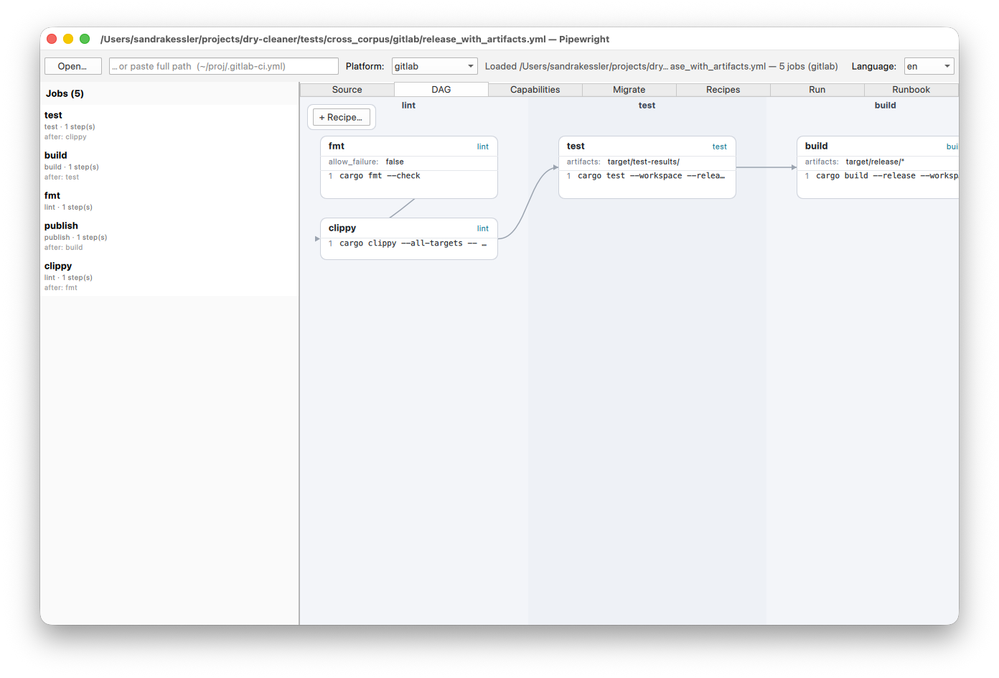

# Pipewright

[](https://github.com/zero-objects/Pipewright/actions/workflows/ci.yml)


A CI/CD pipeline **comprehension and migration** tool. Open any of
**17 platforms'** pipeline definitions — GitLab CI, GitHub Actions,
Jenkins, Azure, CircleCI, drone, bitbucket, buildkite, Tekton, Argo,
Travis, woodpecker, AWS CodeBuild/CodePipeline, Google Cloud Build,
Earthly, dagger — get back the same neutral **Hub-IR**, and from
there inspect, render, document, run locally, migrate to another
platform, or compose with reusable recipes.

Built on a **Triple Graph Grammar** kernel
([`seesaw-tgg`](https://crates.io/crates/seesaw-tgg)): each
platform's rule set is *generated from a declarative construct
catalog* and compiled into both directions, so parsing and emitting
can never drift — every transformation is rule-based, bidirectional,
and round-trip-verified.

## At a glance

```text
   17 surface syntaxes                 one neutral graph              any projection
  ┌──────────────────────┐         ┌──────────────────────┐      ┌─────────────────────────┐
  │ .gitlab-ci.yml       │ forward │       Hub-IR         │      │ inspect (JSON)          │
  │ workflow.yml         │  TGG    │  hub:pipeline        │ ───▶ │ render (SVG / runbook)  │
  │ Jenkinsfile          │ ──────▶ │   ├─ hub:job …       │      │ capabilities profile    │
  │ azure-pipelines.yml  │         │   │   └─ hub:step …  │      │ run locally (Docker)    │
  │ .drone.yml           │ ◀────── │   └─ provenance      │      │ export (md/html/doc)    │
  │ Earthfile  …         │ backward│      (byte spans)    │      └─────────────────────────┘
  └──────────────────────┘  TGG    └──────────────────────┘                 │
            ▲                                 │ re-key / synthesize         │
            └─────────────── migrate ◀────────┘ (all 272 ordered pairs)  ◀──┘
```

The same Hub-IR feeds the **CLI** (`pipewright`), the **Qt6 desktop
app**, and a **C-ABI** (`pipeline-ffi`) for third-party hosts. The
rule sets come from `catalog/` — per-platform construct inventories
plus one neutral field mapping, from which the bidirectional TGG
rules are generated.

## Quick taste

```bash
# Inspect any CI definition — auto-detects the platform (17 supported)
pipewright inspect ./.gitlab-ci.yml | jq '.pipeline.jobs[].name'

# What would run, in what order? (no Docker needed)
pipewright plan ./.gitlab-ci.yml

# Run it locally in Docker, streaming output (container-shell platforms)
# Read-only mount by default; --rw-copy / --rw opt into writes.
pipewright run ./.gitlab-ci.yml --job test

# How portable is it?
pipewright capabilities ./.gitlab-ci.yml

# Migrate — any platform to any platform, even across structural families
pipewright migrate ./.gitlab-ci.yml --to github  > workflow.yml
pipewright migrate ./.drone.yml     --to azure   > azure-pipelines.yml

# Generate a human-readable runbook (en/de)
pipewright render ./.gitlab-ci.yml --format md --locale de

# Compose a pipeline from reusable recipes
pipewright compose --to gitlab recipes/rust-ci.recipe.yml
```

Or the desktop UI — jobs list, editable DAG diagram, capability
profile, migration with friction report, recipe browser/composer,
local runs, exportable runbook:



## Documentation

| | |
|---|---|
| [About](docs/user/about.md) | Vision, the TGG kernel, the construct catalog, Hub-IR, capability and friction concepts |
| [Install](docs/user/install.md) | Build from source, dependencies, packaging |
| [Quickstart](docs/user/quickstart.md) | Five-minute CLI tour with real outputs |
| [User manual](docs/user/manual.md) | Full reference, organised by role: every UI tab, every CLI subcommand, recipes, the FFI surface |
| Evidence | The cross-platform interop matrix in [`docs/interop-matrix.md`](docs/interop-matrix.md) |

## What's in the repo

```
catalog/                         The declarative heart: per-platform construct
                                 inventories + ir.toml field mapping + generators
                                 that emit the per-platform TGG rule sets
crates/                          11 Rust crates, one workspace
├── pipeline-cst                 YAML CST with byte-accurate rebuilt source
├── pipeline-jenkinsfile-cst     Jenkinsfile (Groovy DSL) → same Document shape
├── pipeline-earthfile-cst       Earthfile → same Document shape
├── pipeline-tgg-seeder          Catalog-driven CST → typed-graph seeding + emit
├── pipeline-forward             forward / re-emit / migrate / edit entry points
├── pipeline-hub-ir              Hub-IR read API (jobs, steps, attrs, provenance)
├── pipeline-render              Model lift + SVG diagram + localized runbook prose
├── pipeline-recipe              Port-typed recipe registry, compose & apply
├── pipeline-cli                 The `pipewright` binary (13 subcommands)
├── pipeline-ffi                 C-ABI bridge with cbindgen header
└── chaos-generator              Schema-walking pipeline generator (test harness)

ui/qt6/                          Qt6/QML desktop app (consumes pipeline-ffi)
recipes/                         Standard recipe library (rust-ci, go-ci, …)
tests/cross_corpus/              Real-config corpus, 2 fixtures × 17 platforms
docs/                            user/, interop-matrix
.github/workflows/              CI (lint, test, gate-sample, supply-chain) + release
```

## Status

| Area | State |
|---|---|
| Platforms (parse / forward / backward) | **17**, all bidirectional |
| Round-trip verification | real-config corpus 59/59 · chaos stress 17×30 seeds, 0 failures · byte-identical CST round-trip (full sweep is a nightly CI gate; a fast sample gates every push) |
| Cross-platform interop | **all 272 ordered pairs** faithful + stable ([matrix](docs/interop-matrix.md)) |
| Local Docker runner | live for the 11 container-shell platforms — mounts the repo (**read-only by default**; `--rw-copy`/`--rw` opt into writes), passes env, evaluates `rules:if`/`when`, starts `services:` as sidecars; streamed logs. k8s-CRD / service-orchestration / code-defined platforms are translate-only (the tool says so, doesn't pretend) |
| Migration friction report | derived (re-parse + capability diff), not declared — surfaced in the UI and on the CLI |
| Recipes | standard library + user sources (dir/git), port-aware apply/compose |
| Qt6 desktop UI | 7 tabs incl. editable DAG; en/de; headless smoke test (nightly CI gate) |
| Workspace tests | 300 passing + heavy gates on schedule |
| CI | GitHub Actions — fmt + clippy, tests, round-trip sample gate, MSRV, supply-chain audit on every push; full gates + UI smoke nightly |

## How this was built

Pipewright was developed with heavy AI pair-programming. Every claim
in this README is backed by a test or a gate that runs in CI — the
round-trip numbers, the platform coverage, the run behaviour. The TGG
rule sets are generated from the declarative catalog, not hand-written.
If something here doesn't match what the code does, that's a bug; please
open an issue.

## License

Apache-2.0. See [`LICENSE`](LICENSE).
